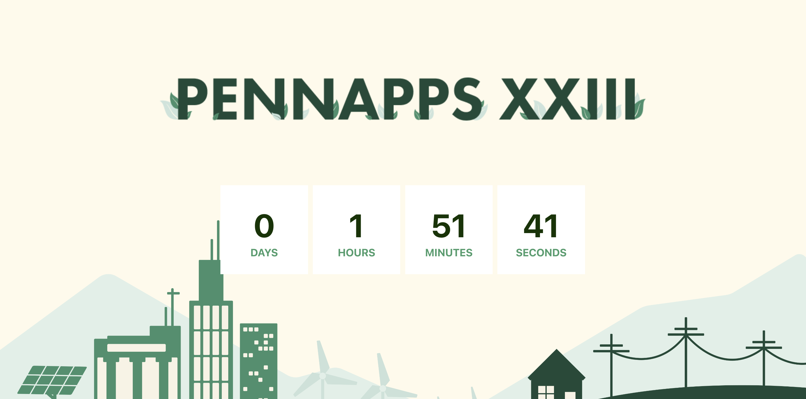

# PennApps-Website
This is my submission for the PennApps front-end challenge!

For this challenge, I primarily used React, JavaScript, and CSS, along with React Bootstrap for my nav bar. I thought that using React was very appropriate for the challenge because PennApps uses Gatsby, which is based on that, and also because it's something I've never learned before that's a very helpful skill for front-end app development!

The image assets use links that are pulled from the front-end github asset folder.

I did reference this code for my timer: https://dev.to/yuridevat/how-to-create-a-timer-with-react-7b9 , which used Reactjs's Date.

# File Structure

The website mainly focuses on four files: `App.css`, `App.js`, `Navbar.js`, and `Timer.js`. The rest sort of came up when I made my default React file.

* `App.css` - update this if you want to fix or work on anything with the website's style.
* `App.js` - update this if you want to add new components to the website.
* `Navbar.js` - update this if you want to adjust any components regarding the navbar.
* `Timer.js` - update this if you want to adjust any of the timer's code or change the timer date.

## Things to still work on

Things get a little bit weird when the website is shrunk, so that won't work very well for devices with different screen sizes, such as an iPhone. This is something I want to look into later.

# How to Run the Site

If you're using VSCode, simply open the terminal and type in `npm start`. This should open up `http://localhost:3000/`, which would then display the website!

